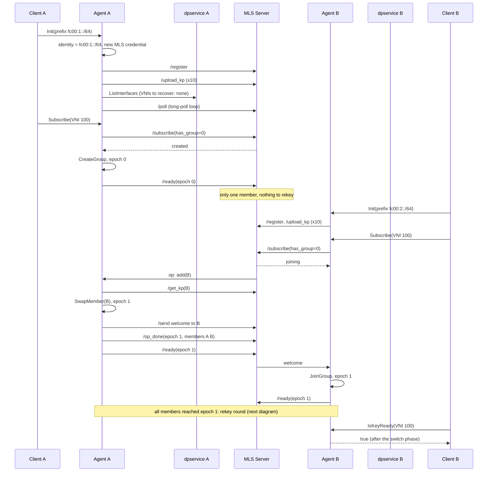
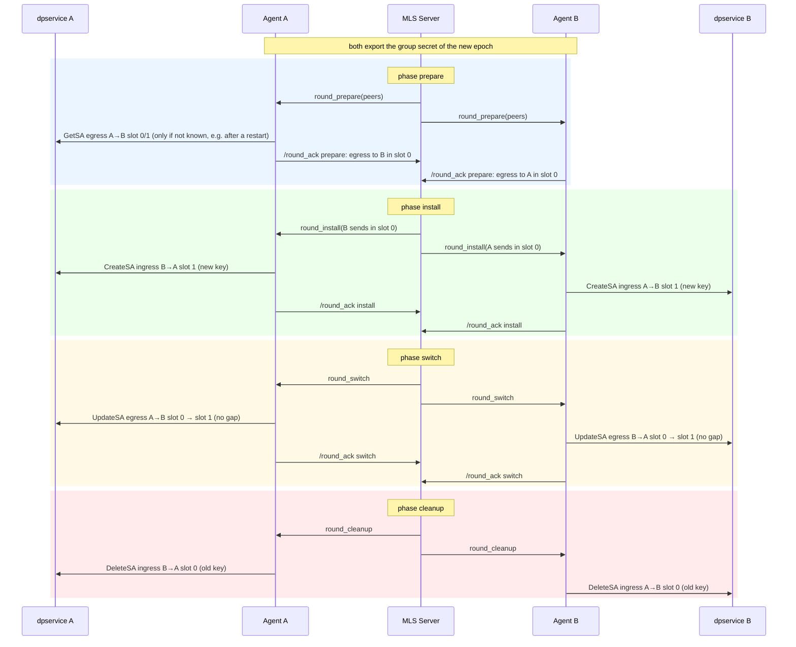
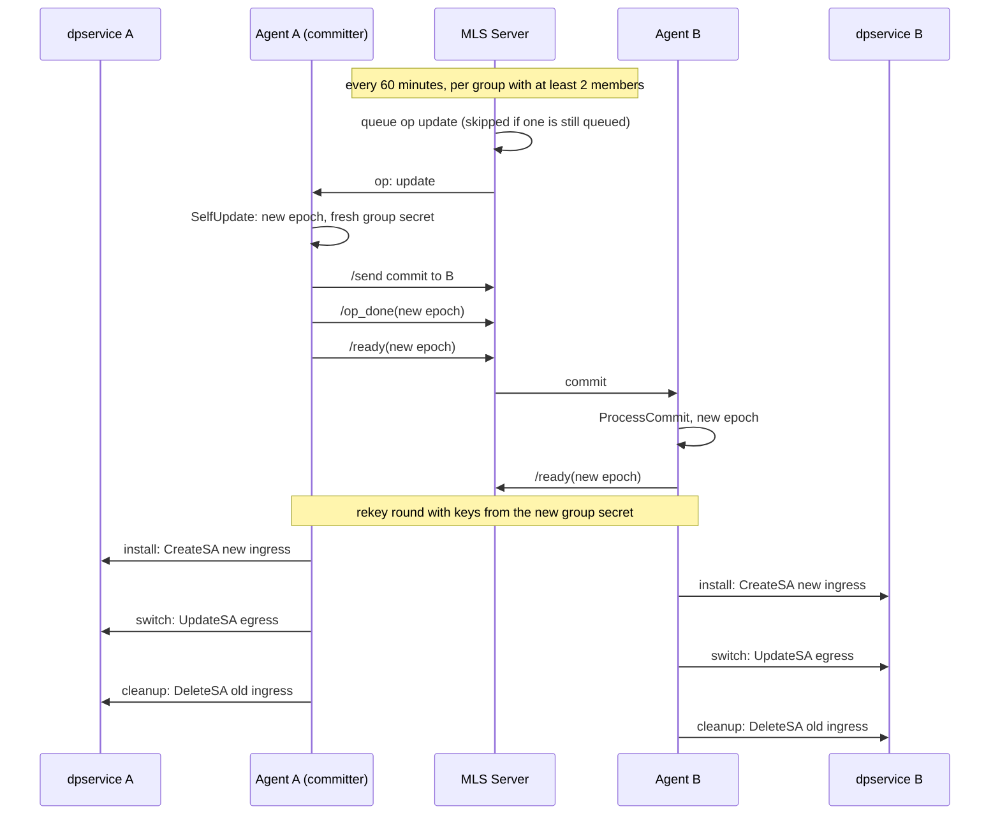
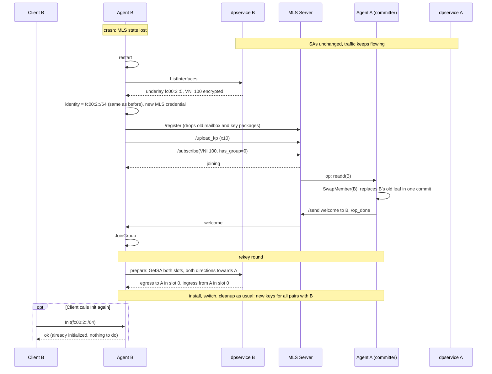
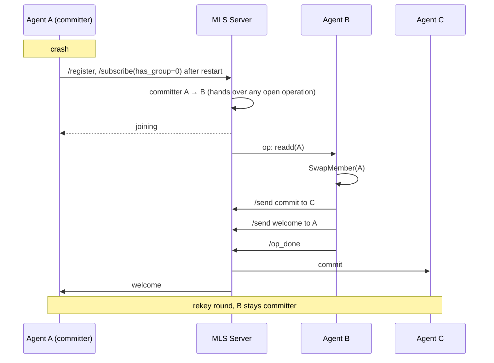
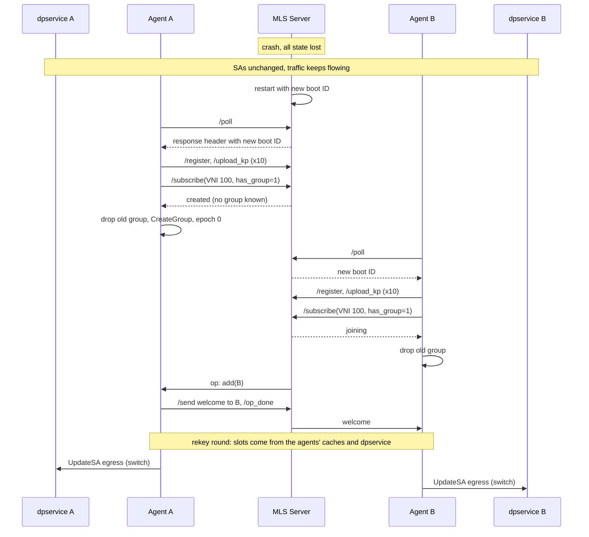
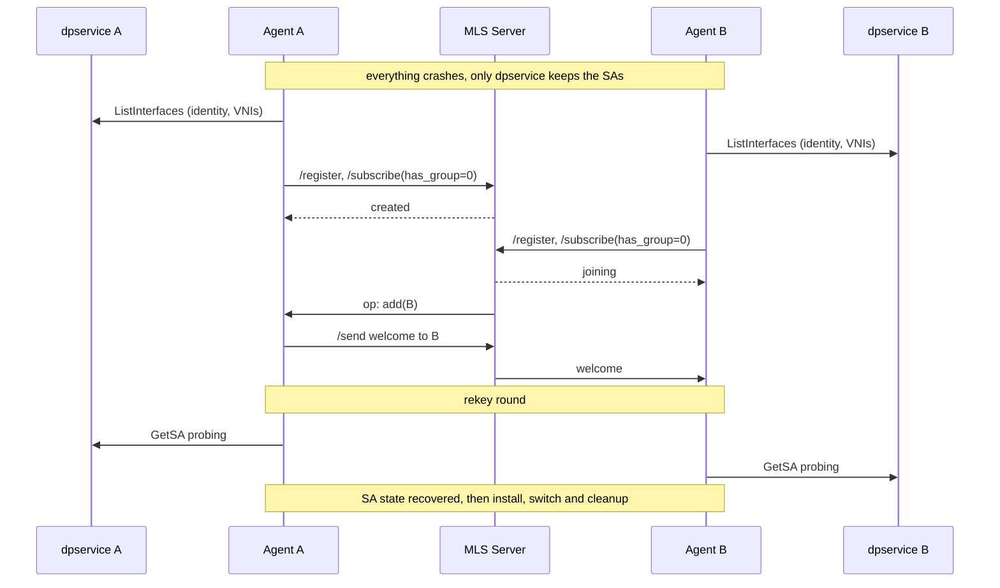
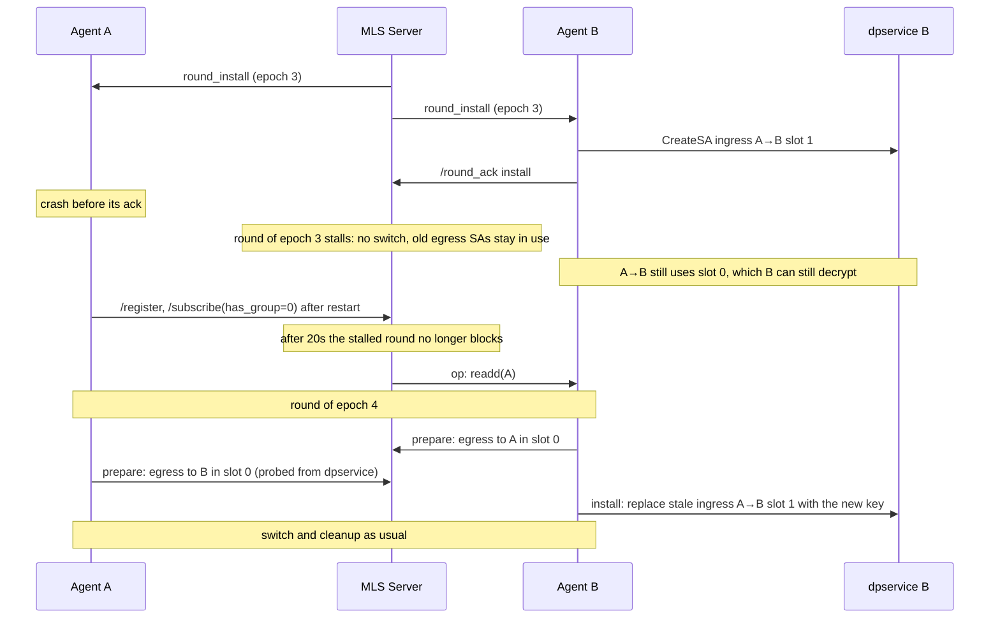
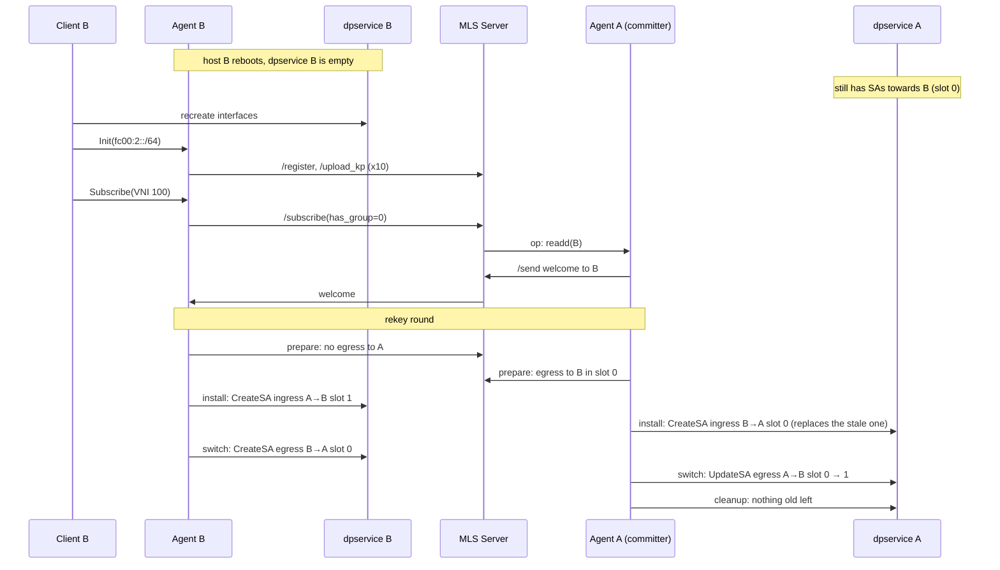
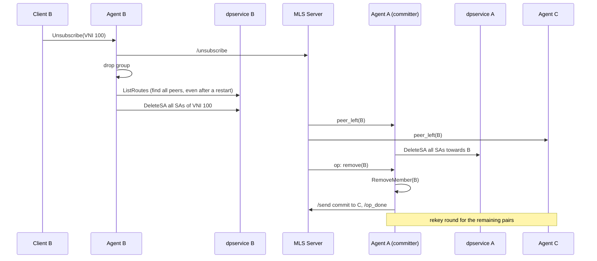

# ironcore-dev-key-exchange

Key exchange for the IPsec encryption of dpservice. All hosts of a VNI form an
[MLS](https://www.rfc-editor.org/rfc/rfc9420.html) group. From the group secret of every epoch,
each host derives the keys of the IPsec Security Associations (SAs) towards every other host of
the VNI and installs them in its dpservice.

## Components

| Component | Where | Role |
|---|---|---|
| **Client** (metalnet) | every host | Tells the agent which VNIs the host takes part in (`pkg/client`) |
| **dpservice** | every host | Dataplane, holds the SAs. Its SA API has no list call |
| **Agent** (`mls_key_exchange`) | every host, exactly one per dpservice | Member of the MLS groups, manages the SAs in its dpservice. Its MLS state lives in the Rust backend (`rust_backend`) in the same container |
| **MLS Server** (`mls_server`) | once | Delivery service and coordinator: mailboxes, key packages, group membership and rekey rounds |

The agent's identity is the underlay /64 prefix of its host (for example `fc00:1::/64`). Because
there is exactly one dpservice per host, it is unique and stable, and it can be read back from
dpservice after a restart.

## Resilience

Neither the agents nor the server store any state. The **SAs in dpservice are the only state that
survives a crash**, and everything else is rebuilt from them:

- **SA slots:** each direction of a host pair has two slots. Their SPIs are derived only from
  VNI, the two underlay prefixes and the slot number. A restarted agent finds its SAs again by
  probing both slots with `GetSecurityAssociation`.
- **Make-before-break rekey:** after every change of the MLS epoch, all host pairs are rekeyed in
  a round of four phases. The receiver installs the new ingress SA first, then the sender
  switches its egress SA (`UpdateSecurityAssociation`, without a gap), and finally the old
  ingress SA is removed. If a crash interrupts a round, the old SAs remain in place.
- **Nothing is deleted by accident:** host pairs with a peer that is not currently part of the
  MLS group are never touched. SAs are only deleted in the cleanup phase of a round or when a
  host unsubscribes.

## Communication flows

In the diagrams, *A*, *B* and *C* are hosts. Each has its own agent and dpservice.

### Initial setup: create a group and join it

The first agent to subscribe to a VNI creates the MLS group and becomes its **committer**. The
committer is the only member that makes commits for the group. Every later agent is added by the
committer.

### Rekey round

This round runs after every epoch change: a join, a leave, a re-add after a restart, or a key
rotation. The server starts each phase only after all members have acknowledged the previous one.
Below it is shown for one host pair. The same happens for all pairs of the group at the same
time.

On an egress SA, the only change is the switch to an ingress SA that the peer has already
installed. An ingress SA is only deleted after every sender has confirmed it no longer uses it.
So at every moment, both ends of a pair can decrypt what the other end sends.

### Key rotation

Every 60 minutes, the server rotates the keys of every group with at least two members. The
interval can be changed with `MLS_KEY_ROTATION_INTERVAL`. The committer makes an MLS self-update
commit, which moves the group to a new epoch with a fresh group secret. The rekey round of that
epoch then replaces the SAs of all pairs, without a gap in traffic. So even a group whose
membership never changes gets new keys regularly, and no SA stays in use long enough to exhaust
its sequence numbers.

A rotation is queued like any other membership operation, so it never runs concurrently with a
join, a leave or a re-add. A group that still has a rotation waiting doesn't get a second one,
for example while it is stalled by a dead member.

### Agent crash or restart

dpservice keeps running, and with it all SAs, so traffic keeps flowing. The restarted agent gets
everything it needs from dpservice, so it doesn't need the Client to call `Init` again. If the
Client does call `Init` again, the call does nothing.

### Committer crash

If the agent that crashed was the committer, the server hands the committer role to another
member. An operation that was still assigned to the old committer is handed over too. A dead
committer that doesn't come back is replaced by the housekeeping loop once it hasn't polled for
45s.

### MLS server crash or restart

The server loses all state, but none of the SAs are affected. The agents notice the restart by
the changed boot ID in the poll responses. They then register and subscribe again, and the groups
are rebuilt from scratch. The old SAs stay in use until the new group has rekeyed each pair.

### Agents and server restart together

This combines the two cases above. Every agent recovers from its own dpservice, and the first
agent to reach the new server creates the group. There is no difference between a *restarted*
and a *fresh* server from the agents' point of view.

### Crash during a rekey round

A round only moves forward when every member has acknowledged the current phase. If a member dies
in the middle of a round, the round stalls. The SAs stay in a consistent state, with at most one
extra ingress SA per pair. After a 20s timeout, the server continues with the next operation,
which is usually re-adding the crashed member. The next round removes any stale SAs.

### Host reboot

When the whole host reboots, dpservice comes back empty and the Client sets it up again, so there
is nothing to recover. On the peers, the SAs towards the rebooted host are still there. They are
replaced by the first rekey round once the host has been re-added.

### Unsubscribe

When a host leaves a VNI, it removes all of its SAs for that VNI. The server tells the remaining
members to delete their SAs towards the leaving host, then the committer removes the host from
the MLS group. The remaining pairs get new keys in the following round.

## Configuration

| Variable | Used by | Default | Meaning |
|---|---|---|---|
| `MLS_SERVER_ADDRESS` | agent | – | URL of the MLS server, e.g. `http://mls-server:4713` |
| `RUST_GRPC_URL` | agent | – | Address of the Rust MLS backend, e.g. `127.0.0.1:50051` |
| `DPSERVICE_ADDRESS` | agent | `127.0.0.1:1337` | gRPC address of dpservice |
| `AGENT_LISTEN_ADDRESS` | agent | `[::]:50052` | gRPC address of the agent API for the Client |
| `RUST_GRPC_LISTEN` | rust backend | `[::]:50051` | gRPC address of the Rust MLS backend |
| `MLS_KEY_ROTATION_INTERVAL` | server | `60m` | Interval of the regular key rotation, as a Go duration (e.g. `30m`, `2h`) |

## Limitations

- An agent that dies and never comes back stops the rekeys of its groups. Rounds stall safely,
  and each membership operation waits for a timeout, but the dead agent is never removed
  automatically.
- If dpservice restarts while its agent keeps running, the agent's cached view of its SAs is out
  of date and its next rekey round stalls. A host reboot restarts both, so it isn't affected.
- dpservice holds at most 64 SAs per host (`DP_IPSEC_MAX_SA`). With two SAs per peer, plus one
  extra during a rekey, that is about 21 peers across all VNIs of a host.
